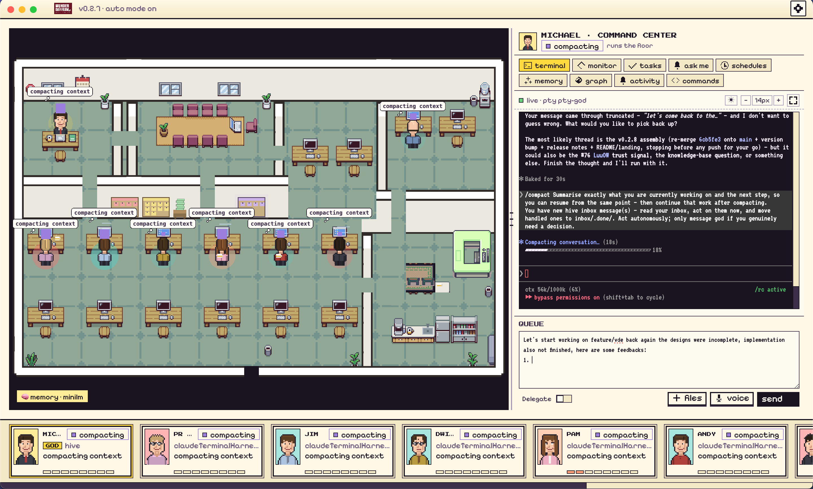

<div align="center">


# Munder Difflin

**Local multi-agent harness for the terminal coding CLIs you already run** —
[Claude Code](https://claude.com/claude-code), Antigravity (Gemini), OpenAI Codex,
**OpenCode**, **Crush**, and **pi.dev** — with bring-your-own keys and local LLMs.
Autonomous agents that message, route, and remember — coordinated by a **GOD** orchestrator
you talk to, and visualized as avatars at work on a shared office floor.

<p>
  <em>Electron · React · TypeScript · Pixi.js · xterm.js · node-pty</em>
</p>

<p>
  <a href="./LICENSE"></a>
  <a href="./CHANGELOG.md"></a>
  
  
  <a href="./CONTRIBUTING.md"></a>
</p>

<br>



<br>

<!-- Inline player renders on github.com (raw URL required; relative paths only link). -->
<video src="https://github.com/chaitanyagiri/munder-difflin/raw/main/docs/media/hero.mp4" poster="https://github.com/chaitanyagiri/munder-difflin/raw/main/docs/media/og.png" controls muted loop playsinline width="820">
  <a href="https://github.com/chaitanyagiri/munder-difflin/raw/main/docs/media/hero.mp4">▶ Watch the floor — Munder Difflin running a hive of Claude Code agents</a>
</video>

</div>

---

> [!NOTE]
> **The world's best agents. The world's worst paper company.**
> Munder Difflin takes the terminal-agent CLIs you already run — `claude`, `agy`, `codex`, `opencode`,
> `crush`, and `pi` — and turns them
> into a self-coordinating team: each agent gets long-term memory, a mailbox, and a desk on a 2D
> office floor — and a **GOD orchestrator agent** routes work between them while you watch.

## Contents

- [What it is](#what-it-is)
- [How it works](#how-it-works)
- [Features](#features)
- [Getting started](#getting-started)
- [Architecture](#architecture)
- [Project structure](#project-structure)
- [Design system](#design-system)
- [Roadmap](#roadmap)
- [Contributing](#contributing)
- [License](#license)
- [Acknowledgements](#acknowledgements)

## What it is

Munder Difflin is a desktop app that wraps **real terminal-agent CLIs** as fully-capable agents,
wires them into a **hive mind**, and puts a **GOD orchestration agent** in charge — the one agent
*you* talk to in order to get things done. Under the hood it runs the **fastest memory layer in the
world** so every agent remembers what it learns and recalls it instantly.

- **Every terminal is an agent.** Each `claude`, `agy`, `codex`, `opencode`, `crush`, `pi`, or custom session runs as a real
  process in a pseudo-terminal (`node-pty`), byte-for-byte authentic, rendered with xterm.js.
- **Every agent is an avatar.** Sessions appear as characters on a Pixi.js office floor — they walk
  to stations as they work, and envelopes fly desk-to-desk when they message each other.
- **The hive coordinates them.** Agents read their memory and drain a mailbox; the router moves
  messages between inboxes; the GOD agent adjudicates, assigns, and escalates only when it needs you.
- **Memory that's instant.** A markdown-first memory layer with a semantic recall index means agents
  remember across sessions and recall in milliseconds.

## How it works

```
            you ── talk to ──►  ┌─────────────┐
                                │  GOD agent  │  orchestrator / supervisor
                                │ (Michael's  │  roster · routing · adjudication
                                │   office)   │  blackboard · task ledger
                                └──────┬──────┘
                                       │ assigns · routes · escalates
              ┌────────────────────────┼────────────────────────┐
              ▼                         ▼                         ▼
        ┌───────────┐            ┌───────────┐            ┌───────────┐
        │  agent A  │  message   │  agent B  │  message   │  agent C  │
        │ provider  │ ─────────► │ provider  │ ─────────► │ provider  │
        │  + memory │            │  + memory │            │  + memory │
        └───────────┘            └───────────┘            └───────────┘
              └──────── shared hive: memory · mailbox · blackboard · log ───────┘
```

1. **You spawn agents** — each is a normal terminal process (`claude`, `agy`, `codex`, or custom)
   with its own working directory, identity, and provider-specific lifecycle.
2. **Agents collaborate through the hive** — a local git repo of plain files. They write to their own
   `outbox/`; the harness's router delivers into recipients' `inbox/`. No agent ever touches git
   (single-committer design avoids `index.lock` corruption).
3. **The GOD agent runs the floor** — it reads every request, resolves routine ones itself (keeping
   the system fully autonomous), and only escalates *critical* items (spend, destructive ops, scope
   changes) into an approvals queue you act on.
4. **Everything is visible** — you watch avatars move, envelopes fly, and the live terminal stream;
   you can type back into any session, browse its files, and read its git history.

See [`HIVE.md`](./HIVE.md) for the full multi-agent design, [`SPEC.md`](./SPEC.md) for the
terminal/event plane, and [`DESIGN.md`](./DESIGN.md) for the visual system.

## Features

| Area | What works today |
|---|---|
| **Real terminals** | Spawn Claude Code, Antigravity (`agy` / Gemini), OpenAI Codex, or a custom command in a `node-pty` PTY. Full read/write/resize/kill, live streaming over IPC, multi-agent. |
| **Multi-provider hive** | Claude Code, Antigravity, and Codex workers can all participate in the same hive. Claude uses native hooks; Antigravity gets a native `agy-hook` bridge; Codex receives the protocol as its initial prompt and participates through inbox/outbox routing. |
| **The hive** | On-disk multi-agent layer: per-agent identity + long-term memory, atomic-file mailboxes, a shared blackboard, append-only event log, single-committer git. |
| **GOD orchestrator** | An always-on supervisor agent that adjudicates traffic, routes tasks, scribes the blackboard, and escalates only critical items to you. |
| **Memory layer** | Markdown-first long-term memory per agent, mined into a shared semantic palace for instant recall; searchable from the UI. Degrades gracefully when the index isn't installed. |
| **Office floor** | Pixi.js scene with a Tiled office map, camera, recolored cast, pathfinding, seat assignment, and tool-bubble overlays. |
| **Message handoffs** | When the hive routes a message, an envelope flies from sender to recipient (tinted by speech-act; escalations fly to the door) and pops an arrival sparkle. |
| **Per-agent panel** | Live terminal, command bar to type back, fullscreen terminal, sandboxed file browser + CodeMirror editor, and a git tab (status, log, commit graph, branches). |
| **Approvals & memory panels** | Human-in-the-loop approval queue for escalations; a memory search panel over the shared palace. |
| **Onboarding wizard** | First-run setup: harness home, registered repos, default command, auto-mode. |
| **Design system** | Fully tokenized SNES / Animal-Crossing aesthetic — pixel panels, buttons, badges, hand-drawn icons. See [`DESIGN.md`](./DESIGN.md). |
| **Command Center** | Michael's control surface: Terminal, Floor (roster + dispatch + per-agent model selector + live fleet monitoring), Memory (MemPalace + text search + memory graph), Activity (log + board + real token telemetry + observability + CI watcher), Tasks (kanban board with dependencies + status tracking), and a dedicated Schedules tab (recurring missions + adaptive heartbeat). |
| **Talk to Michael (Realtime Michael)** | A low-latency **voice channel to the GOD orchestrator** (OpenAI Realtime API over WebRTC), alongside the async terminal. Press **Talk** and Michael listens, answers, and *acts* in real time — reads the hive and, behind spoken **echo-back confirmation** for destructive verbs, creates/assigns tasks, dispatches, spawns/kills workers, and steers the floor (attributed to a distinct **michael-voice** actor). He greets you on connect, **speaks task completions the moment they land** ("respond when done"), and runs under a live cost meter with a hard spend cap + idle auto-disconnect. **BYOK OpenAI key** — decrypted main-only, minted into short-lived ephemeral session tokens, never read back to the renderer. |
| **Per-agent git worktrees** | 'Git isolation' toggle in Add Agent auto-provisions a dedicated worktree per agent on spawn and tears it down on kill — agents never collide on branches. |
| **Token & cost telemetry** | Activity tab reads `~/.claude/projects/` JSONL transcripts and surfaces real token counts + estimated USD cost per agent per session, backed by a durable cost ledger that survives restarts. |
| **Per-agent token budgets** | Set a token budget per agent and watch live fleet monitoring track consumption across the whole roster — paired with the cost/runaway circuit breaker to keep spend in check. |
| **Observability** | Live OpenTelemetry collector with per-model cost attribution, a fleet grid, and a per-agent tool-span waterfall — see exactly what every agent is doing and what it costs, in real time. |
| **Context-window gauge** | Each agent card's progress bar is a context-window gauge — see how much of the model's context each agent has consumed at a glance. |
| **Circuit breaker** | A cost/runaway guard with a steer → constrain → stop ladder: the breaker nudges, then constrains, then stops agents that loop, storm errors, or blow their budget. |
| **HITL gate & mid-run control** | Human-in-the-loop gate, mid-run steer, and graceful stop — all driven through Claude Code hook returns, so you can intervene without killing the session. |
| **Durable persistence** | SQLite-backed durable store keeps window bounds + history across restarts, alongside the durable cost ledger and persisted session IDs. |
| **MemoryReflector** | Memory condensation that summarizes and bounds per-agent memory over time, so long-term memory doesn't grow without limit. |
| **Configurable home folder** | Point the hive/memory home at any folder, with a safe move that relocates existing state without losing it. |
| **Restore team** | One-click "Restore team" rebuilds last session's workers after a harness restart — no more re-adding agents by hand. |
| **Selectable agent engines** | Each agent — and Michael himself — runs on a pluggable engine: Claude Code, Antigravity, OpenAI Codex, **OpenCode**, **Crush**, **pi.dev**, or a local provider (a claw/qwen backend proxy). Choose the engine per hire from a visual provider/hive picker; the orchestrator's own engine is swappable from onboarding or a change-engine flow. BYOK keys + local-LLM endpoints for the CLI engines live in **Settings → AI Engines**. |
| **BYOK keys + local LLMs** | **Settings → AI Engines** collects per-provider API keys (Anthropic / OpenAI / Google / OpenRouter / Groq) stored **write-only** in the encrypted secret broker — never read back into the renderer, materialized main-only at spawn — plus per-engine **local base-URLs** (Ollama / LM Studio / vLLM) and default-model fields. The OpenCode / Crush / pi.dev engines pick these up at spawn. |
| **OSS-model quick-picks** | Hiring a worker on a local-capable engine (OpenCode / Crush / pi.dev) surfaces curated open-source model quick-picks — a **Local** bucket (Mac-runnable Ollama tags: gpt-oss 20B/120B, Qwen3, DeepSeek-R1, Mistral Small, Llama 3.3 70B …) and a **third-party OSS provider** bucket (BYOK via Groq / OpenRouter) — that fill the engine-correct slug (`local/<tag>` for OpenCode, `ollama/<tag>` for Crush/pi) and rebuild the spawn command. Two how-to guides — [run on open models](https://munderdiffl.in/blog/run-munder-difflin-on-open-models/) and [run on a Mac Mini](https://munderdiffl.in/blog/run-munder-difflin-on-a-mac-mini/) — are linked inline. |
| **Provider-agnostic idle backstop** | A PTY-quiescence fallback flips any silent-but-pinned-`working` agent back to *idle*, so the idle inbox-wake nudge always drains a non-Claude orchestrator even if a bridge's turn-end signal (`Stop` / `session.idle` / `agent_end`) never fires — the safety net under shipping every new engine as god-eligible. |
| **Self-healing engine install** | When a chosen engine's CLI binary is missing, the harness runs its installer in the terminal, then **auto restart-and-continues** into the freshly-installed binary in place — no dead-end, no manual click, idempotent so the installer never fires twice. |
| **Per-hire skills + MCP catalog** | Every hire carries a manifest of allowed skills + MCP servers (default-deny over a shared catalog). Bundled skills ship with the app, and a consent UI surfaces every skill/MCP a hire wants before it can use it — untrusted hire input is reviewed, never auto-granted. |
| **Integrations registry + secret broker** | A declarative integrations registry with a registry-driven Settings UI and a loopback secret broker: secrets are write-only (set once, never read back into the renderer) and reached only through the broker. Ships with a first wave of declarative templates. |
| **Slack-spawned ephemeral workers** | Michael can spawn an isolated worker straight from a Slack request, have it post its reply back into the thread, then tear it down safely — with worktree GC, per-worker token caps, and a teardown gate that never auto-discards unintegrated work. Live workers appear in a dedicated Workers tab. |
| **Temporal date-range skills** | A family of date-range skills (today / yesterday / thisWeek / lastWeek / thisMonth / thisQuarter / thisYear / lastMonth / last7Days / last30Days … plus an arbitrary-range resolver) turns a named window into concrete ISO dates, with a worker capability catalog so each spawned worker knows exactly what tools/integrations it has. |
| **Shareable hires + the Agent Gallery** | Import a ready-made agent role — provider, model, flags, goal, capabilities, token budget — from a `munderdifflin://hire` deep link or a local manifest file. Import only *pre-fills* the Add-Agent modal (behind an "imported" banner); spawning stays a human click. The manifest is validated as untrusted input (no executable field, a default-deny flag allowlist, an https-only bounded fetch). Browse ready-made roles, including six off-the-shelf hires, at the [Agent Gallery](https://munderdiffl.in/hires/). |
| **Task kanban** | Dependency-aware kanban board in the Command Center Tasks tab — assign tasks to agents, track status across todo/doing/blocked/done, wire dependencies so work starts in order. |
| **Scheduled missions & heartbeat** | Recurring auto-dispatch missions with label, interval, target agent, and body — plus a scheduler heartbeat that re-engages the floor when it goes quiet. Missions now live in their own Schedules tab with last/next-fired times. |
| **Terminal work-order handoff** | Providers without an inbox-drain hook receive hive mail as a `WORK ORDER FROM HIVE` typed into their terminal; if the renderer is unavailable, the message bounces to the GOD agent instead of disappearing. |
| **Slack/webhook ingress** | Slack and generic webhook ingress expose local endpoints through tunnelmole, so POSTs pass straight through and failed tunnels surface a real error instead of a silent broken URL. |
| **GitHub ingestion** | Pull open issues from any registered repo via the `gh` CLI and assign them to agents with one click from the Command Center. |
| **CI status watcher** | Live pass/fail/in-progress status for GitHub Actions runs, visible in the Activity tab for every registered repo. |
| **Threaded chat** | Every hive message is grouped by conversation and rendered as a reply chain in each agent's Messages tab — readable, replyable, auditable. |
| **Desktop notifications** | Native OS notifications when an agent finishes a task or is waiting for your input. |
| **Agent archival** | Closing an agent tab archives it (memory + history preserved) rather than destroying it. |
| **Avatar states** | Avatars reflect real work — including new v0.2.0 states for *compacting* (context compaction) and *looping* (circuit-breaker intervention), on top of crisper HiDPI floor text and high-contrast speech bubbles. |

> [!NOTE]
> **Status: v0.3.2 — Talk to Michael (Realtime Michael).** The headline is a **low-latency voice channel to the GOD orchestrator** that runs alongside the async terminal floor. Press **Talk** and Michael listens, answers, and *acts* in real time over the **OpenAI Realtime API (WebRTC)**: he reads the hive (tasks, board, memory, agents, activity) and — behind spoken **echo-back confirmation** for anything destructive — creates and assigns work, dispatches agents, spawns and kills workers, and steers the floor, all attributed to a distinct **michael-voice** actor that pings the GOD terminal. He **greets you on connect**, **speaks task completions the moment they land** ("respond when done", with an on-screen toast + closed-session warm-start), and runs under a **live cost meter with a hard spend cap and idle auto-disconnect**. It's **bring-your-own OpenAI key**: the key is decrypted **main-only**, minted into **short-lived ephemeral session tokens**, and never reaches the renderer — and **Settings → AI Engines** documents the Realtime key as its own requirement, with the **Talk** button showing a live enabled/disabled cue. The realtime loop is **human-verified end-to-end** (connect → mic → answer, plus the full spawn/kill/dispatch action path) on a real OpenAI key; it requires **your own OpenAI key with Realtime API access**. Plus **Slack hardening** (proactive app/voice posting **off by default**; no sends without an explicit channel+thread), a dedicated **auto-compact maintenance schedule** decoupled from missions, and **per-agent environment metadata**. Built on **v0.3.1** (three more engines — **OpenCode · Crush · pi.dev** — each a worker *and* Michael, with **BYOK keys + local LLMs**) and **v0.3.0**'s platform release — **selectable agent engines** (every hire and Michael a pluggable engine with its own consented **skills + MCP catalog** behind a **consent UI**), an **integrations registry + loopback secret broker** (write-only secrets), **Slack-spawned ephemeral workers**, **temporal date-range skills**, and the **Agent Gallery** with **six off-the-shelf hires**. Everything from **v0.2.0–v0.3.1** — shareable hires, Free Flow voice dictation, the enterprise Knowledge Graph, multi-window "floors", the rich composer, agent session resume, observability, the circuit breaker, durable persistence, Command Center, task kanban, GitHub/CI integration, and the Schedules tab — remains functional and shipping. macOS (signed), Windows, and Linux builds are available on the releases page.

<div align="right">(<a href="#munder-difflin">↑ back to top</a>)</div>

## Getting started

### Prerequisites

- **macOS, Windows, or Linux**.
- **Node.js 18+** and npm.
- A **C/C++ toolchain** for `node-pty`'s native addon — on macOS, install Xcode Command Line Tools:
  ```bash
  xcode-select --install
  ```
- At least one supported terminal-agent CLI on your `PATH`: **[Claude Code](https://claude.com/claude-code)**
  (`claude`, the default command), **Antigravity** (`agy`, Gemini), **OpenAI Codex** (`codex`),
  **OpenCode** (`opencode`), **Crush** (`crush`), or **pi.dev** (`pi`). Claude uses native hooks,
  Antigravity uses the `agy-hook` bridge, Codex participates through initial-prompt protocol injection
  plus inbox/outbox routing, and OpenCode / Crush / pi.dev wire in via a native-plugin / proxy / hooks
  bridge respectively. A missing engine CLI self-heals — the harness runs the installer in the
  terminal, then auto restart-and-continues into the freshly-installed binary.
- *Optional:* **bring-your-own API keys + local LLMs.** For the CLI engines, set per-provider keys and
  local base-URLs (Ollama / LM Studio / vLLM) in **Settings → AI Engines**; see the guides on
  [running on open models](https://munderdiffl.in/blog/run-munder-difflin-on-open-models/) and
  [running on a Mac Mini](https://munderdiffl.in/blog/run-munder-difflin-on-a-mac-mini/).
- *Optional:* the semantic memory index for instant cross-session recall (the app works without it —
  markdown memory still functions).

### Install & run

```bash
git clone https://github.com/chaitanyagiri/munder-difflin.git
cd munder-difflin
npm install        # postinstall rebuilds node-pty against Electron's ABI
npm run dev        # launches the Electron app with hot reload
```

On first launch you'll go through the onboarding wizard, then land on the floor. Use **Add agent** to
spawn your first session — the GOD agent seats itself in Michael's office automatically.

### Other scripts

```bash
npm run build      # production build via electron-vite
npm run preview    # preview the production build
npm run typecheck  # type-check the node (main/preload) and web (renderer) projects
```

> If `node-pty` fails to load after an Electron upgrade, re-run `npm install` (the `postinstall` hook
> runs `electron-rebuild` against the current Electron ABI).

## Architecture

Two data planes feed one renderer:

```
┌───────────────────────────────────────────────────────────────┐
│                     Electron Renderer (React)                  │
│   ┌──────────────────┐    ┌──────────────────────────────┐    │
│   │ Office Floor      │    │ Terminal + Command Bar       │    │
│   │ (Pixi.js)        │    │ Files + Git tabs (xterm.js)  │    │
│   └─────────▲────────┘    └────────────▲─────────────────┘    │
│             │ avatar state             │ pty bytes / fs / git  │
└─────────────┼──────────────────────────┼───────────────────────┘
              │ IPC (contextBridge: window.cth)
       ┌──────┴──────────┐        ┌──────┴─────────────┐
       │  Event Plane    │        │  Terminal Plane    │
       │  hooks / hive   │        │  node-pty PTYs     │
       │  router + GOD   │        │  + fs + git        │
       └────────▲────────┘        └──────▲─────────────┘
                │ hook payloads          │ stdin / stdout
                └─────────┬──────────────┘
                   ┌──────┴──────────────┐
                   │ claude / agy / codex│
                   └─────────────────────┘
```

- **Terminal plane.** The main process owns a `PtyManager` that spawns each agent as a `node-pty`
  process and streams output over per-id IPC (`pty:data:<id>`). The renderer talks only through a
  typed `window.cth` bridge ([`src/preload/index.ts`](./src/preload/index.ts)), which also exposes
  sandboxed filesystem and git helpers.
- **Hive / event plane.** `hive.ts` is the on-disk multi-agent layer; `hooks.ts` runs the hook
  server that provider bridges POST lifecycle payloads to (`cth-hook` for Claude Code, `agy-hook`
  for Antigravity). `memory.ts` wraps the semantic memory CLI. The router delivers messages, drains
  provider outboxes, the GOD agent adjudicates, and idle/inbox wakeups keep workers draining mail.

## Project structure

```
src/
  main/                      Electron main process (Node)
    index.ts                 window, IPC handlers, quit guard
    pty.ts                   node-pty manager (spawn/write/resize/kill/stream)
    hive.ts                  on-disk multi-agent layer (memory, mailboxes, router)
    hooks.ts                 hook server + provider hook shims (`cth-hook`, `agy-hook`)
    memory.ts                semantic memory layer (CLI wrapper, degrade-to-noop)
    config.ts                harness config persistence + home setup
    transcript.ts            reads ~/.claude/projects/ JSONL transcripts for real token/cost telemetry
    telemetry.ts             live OTel collector + usage/cost feed for observability
    usage.ts / pricing.ts    UsageProvider seam + per-model cost attribution
    breaker.ts / control.ts  cost/runaway circuit breaker (steer/constrain/stop) + HITL gate / steer / stop
    reflect.ts               MemoryReflector — memory condensation
    db.ts                    SQLite durable store (window bounds + history) + durable cost ledger
    github.ts                GitHub issue + CI run ingestion via the gh CLI
    shellEnv.ts              resolve PATH and shell env for child processes
    fs.ts / git.ts           sandboxed filesystem + git bridges
  preload/                   contextBridge → typed window.cth API
  renderer/src/
    App.tsx                  top-level layout + wiring
    design/                  tokens.css / tokens.ts / global.css (design source of truth)
    components/              PixelPanel, AgentDetailPanel, CommandBar, ApprovalsPanel, MemoryPanel, …
    CommandCenterPanel,      Michael's control surface (Terminal/Floor/Memory/Activity/Tasks/Schedules/Handbook tabs)
    ToolWaterfall,           per-agent tool-span waterfall for the observability view
    TasksKanban,             dependency-aware kanban board (Tasks tab)
    ThreadsPanel,            hive message conversation viewer (Messages tab)
    MessageQueueComposer,    park messages for a busy agent
    scene/office/            Pixi office floor: OfficeFloor, Character, Camera, cast, pathfinding, …
    store/ · hooks/          zustand store, event loop, PTY parser, typewriter
    assets/                  tilesets, maps, character sheets (see ATTRIBUTION.md)
docs/                        `logo.png`, `banner.png`, landing page (GitHub Pages → munderdiffl.in)
docs/media/                  `og.png` (social previews) + rendered Remotion clips
landing-remotion/            Remotion project that renders the landing page's "how it works" clips
HIVE.md · SPEC.md · DESIGN.md   multi-agent · terminal/event · visual design
```

<div align="right">(<a href="#munder-difflin">↑ back to top</a>)</div>

## Design system

The aesthetic is **Animal Crossing × Earthbound × SNES menu UI** — pixel-snapped, chunky, friendly.
[`DESIGN.md`](./DESIGN.md) is canonical; every component derives from its tokens. The Munder Difflin
brand layers a **Dunder-Mifflin maroon** (`#6E1423`) and **gold** (`#F4D35E`) on top for logo and
chrome. The 15 avatars are the cast of *The Office*, differentiated by hair/skin/shirt recipes.

## Roadmap

Shipped in **v0.2.0–v0.3.2**:

- [x] **Talk to Michael — Realtime Michael (v0.3.2)** — a low-latency **voice channel to the GOD orchestrator** (OpenAI Realtime API over WebRTC) next to the async terminal. Michael listens, answers, and *acts* in real time — reading the hive and, behind spoken **echo-back confirmation** for destructive verbs, creating/assigning tasks, dispatching, spawning/killing workers, and steering the floor as a distinct **michael-voice** actor. Greets you on connect, **speaks completions** the moment they land ("respond when done"), and runs under a **live cost meter + spend cap + idle auto-disconnect**. **BYOK OpenAI key** — decrypted main-only, minted into short-lived ephemeral tokens, never read back to the renderer (requires Realtime API access; human-verified end-to-end). Plus **Slack hardening** (proactive posting off by default, no sends without an explicit thread), a dedicated **auto-compact maintenance schedule**, and **per-agent environment metadata**.
- [x] **Three more engines — OpenCode · Crush · pi.dev (v0.3.1)** — each selectable as a worker *and* as Michael, via a native-plugin / proxy / hooks bridge, with **BYOK keys + local LLMs** in **Settings → AI Engines**, **OSS-model quick-picks** in Add-Agent, a **self-healing engine installer**, and a **provider-agnostic idle backstop**. Two local-setup guides: [run on open models](https://munderdiffl.in/blog/run-munder-difflin-on-open-models/) · [run on a Mac Mini](https://munderdiffl.in/blog/run-munder-difflin-on-a-mac-mini/). *(Live runtime verification with real model calls is an on-device check pending BYOK keys / a local LLM.)*
- [x] **Selectable agent engines + per-hire capabilities** — a pluggable engine per hire (Claude Code / Antigravity / Codex / local provider) and a swappable Michael engine, each with its own consented skills + MCP catalog.
- [x] **Integrations registry + loopback secret broker** — write-only secrets, a registry-driven Settings UI, and a first wave of declarative templates.
- [x] **Slack-spawned ephemeral workers** — Michael spawns an isolated worker from a Slack request, replies in-thread, then tears it down safely (worktree GC + per-worker token caps), surfaced in a Workers tab.
- [x] **Temporal date-range skills + worker capability catalog** — named windows resolve to concrete ISO dates, and each worker can read exactly what tools/integrations it has.
- [x] **Agent Gallery + six off-the-shelf hires** — *The Hiring Fair* rebranded, with a visual Provider/Hive picker in onboarding and add-agent and feature-aware onboarding.
- [x] **Wake-reliability hardening** — auto-revive wedged terminals, catch up missed schedules, and re-arm the hive message router (draining any mail that piled up) when the machine wakes.
- [x] **Shareable hires** — import a role-configured agent from a `munderdifflin://hire` deep link or a local manifest; import pre-fills the Add-Agent modal (the human spawns), and the manifest is validated as untrusted input. Ready-made roles live in the [Agent Gallery](https://munderdiffl.in/hires/).

- [x] **Heartbeat** — scheduler heartbeat that re-engages the floor when it goes quiet, with last/next-fired times surfaced in the Schedules tab.
- [x] **Memory reflection** — the MemoryReflector summarizes and bounds per-agent memory over time to prevent unbounded growth.
- [x] **Persistence** — SQLite-backed durable store for window bounds + history across restarts, plus a durable cost ledger and persisted session IDs.
- [x] **Hook-driven avatars** — broadened hook→station coverage and caged the synthetic demo loop, with new *compacting* and *looping* avatar states.
- [x] **Multi-provider floor** — Claude Code, Antigravity (`agy` / Gemini), and OpenAI Codex can participate in the same hive (Codex reaches full hive parity via a native lifecycle-hook bridge).
- [x] **Dedicated Schedules tab** — recurring missions and the adaptive heartbeat have their own Command Center tab.
- [x] **Tunnelmole ingress** — Slack and generic webhook public URLs use tunnelmole instead of localtunnel.
- [x] **Voice dictation (Free Flow)** — hold Option to talk; Groq Whisper transcribes speech straight into the message composer (gated on a Groq key, encrypted at rest).
- [x] **Enterprise Knowledge Graph** — a multimodal store of your own documents/policies/context, with a CLI agents query for ranked passages and full documents.
- [x] **Multi-window "floors"** — isolated office windows, each with its own set of agents and per-PTY routing.
- [x] **Rich message composer** — file & image attachments (files button or paste-to-attach) as removable chips above a taller, resizable input.
- [x] **Session resume** — agents reattach their prior conversation across an app restart, with a per-agent *Restart & Continue* button; restored workers re-enter their existing worktree.
- [x] **Terminal file-drop** — drag a file onto an agent's terminal to inject its absolute, shell-escaped path into the session.

Next up:

- [ ] **More chat integrations** — Telegram and richer chat bridges that pipe a channel straight into Michael's queue (and route his replies back out), so you can run the floor from your phone.
- [x] **More engines & providers** — the engine abstraction is in (Claude Code, Antigravity, Codex, local providers), and **v0.3.1 shipped OpenCode, Crush, and pi.dev** as worker+god engines with BYOK keys + local LLMs (live runtime verification pending on-device keys). Keep adding engines and broadening the per-hire capability catalog on top of it.
- [ ] **More integration templates** — grow the integrations registry beyond the first-wave templates.
- [ ] **Fuller avatar coverage** — push the remaining station visits and tool-bubbles to be driven 100% by real Claude Code hook events.
- [ ] **Durable layout & command history** — extend persistence to agent layout and per-session command history.

<div align="right">(<a href="#munder-difflin">↑ back to top</a>)</div>

## Contributing

Contributions are welcome — this is an early prototype with a lot of surface area. Start with
[`CONTRIBUTING.md`](./CONTRIBUTING.md). The short version: fork, `npm install && npm run dev`, keep
`npm run typecheck` green, and **derive any new UI from [`DESIGN.md`](./DESIGN.md) tokens**. Good
first areas: wiring real hook events, the add-agent flow, the config drawer, and cross-platform work.

## License

> [!IMPORTANT]
> **Asset licensing.** The bundled pixel art (tilesets, maps, and the base character sheets the
> Office cast is recolored from) comes from [LimeZu](https://limezu.itch.io/) via
> [`shahar061/the-office`](https://github.com/shahar061/the-office) under the **LimeZu FREE VERSION
> license — non-commercial use only**. The recolored sprites inherit that restriction. See
> [`src/renderer/src/assets/ATTRIBUTION.md`](./src/renderer/src/assets/ATTRIBUTION.md). **To
> commercialize, replace these assets or obtain a paid LimeZu license.**

The **source code** is licensed under the **MIT License** — see [`LICENSE`](./LICENSE). The MIT grant
covers the code only; the non-commercial asset restriction above is carved out in the `LICENSE` scope
note. *Munder Difflin* is an affectionate parody and is not affiliated with NBC's *The Office* or
Dunder Mifflin.

## Acknowledgements

- [LimeZu](https://limezu.itch.io/) — pixel-art tilesets and character base sheets.
- [`shahar061/the-office`](https://github.com/shahar061/the-office) — office tileset/map vendoring.
- [Pixi.js](https://pixijs.com/) · [xterm.js](https://xtermjs.org/) · [node-pty](https://github.com/microsoft/node-pty) · [electron-vite](https://electron-vite.org/) · [CodeMirror](https://codemirror.net/) — the libraries this is built on.
- [Remotion](https://www.remotion.dev/) — the landing page's animated "how it works" clips (`landing-remotion/`).
- *The Office* (US) — for Munder Difflin, Inc.
